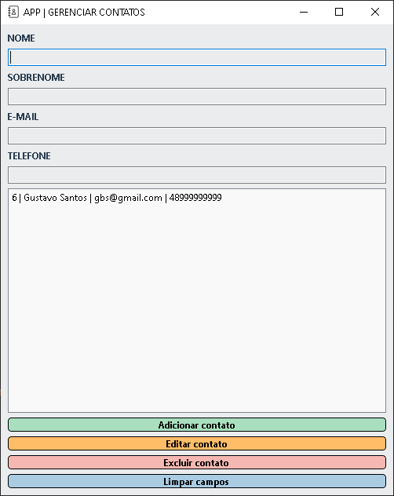

# Aplicativo de Gerenciamento de Contatos

> Objetivo: Desenvolver um aplicativo Desktop de gerenciamento de contatos utilizando a biblioteca PySide6 e SQLite. O aplicativo deve permitir adicionar, editar, excluir e listar contatos, bem como limpar os campos de entrada de dados.

<br>



## 💻 Pré-requisitos

Antes de começar, verifique se você atendeu aos seguintes requisitos:

* Você instalou a versão mais recente do Python ou 3.11.4
* Você tem uma máquina: Windows / Linux / Mac

## 🚀 Instalando qt-python-cadcontatos

Para instalar o qt-python-cadcontatos, siga estas etapas:

Windows ou Linux 
```
# git clone https://github.com/bonella/qt-python-cadcontatos.git

# pip install requirements.txt

# python main.py (ou rodar com a IDE)
```

## 📝 Licença

Esse projeto está sob licença. Veja o arquivo [LICENÇA](LICENSE.md) para mais detalhes.

[⬆ Voltar ao topo](#Aplicativo de Gerenciamento de Contatos)<br>
